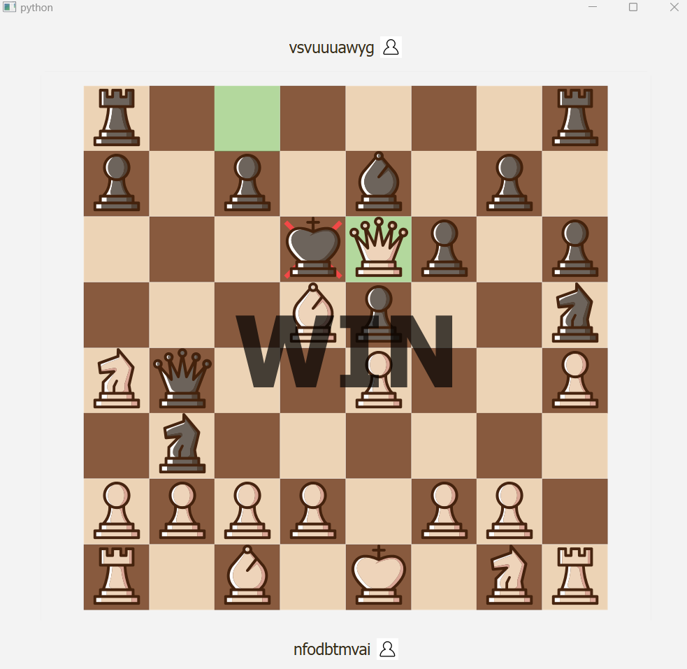
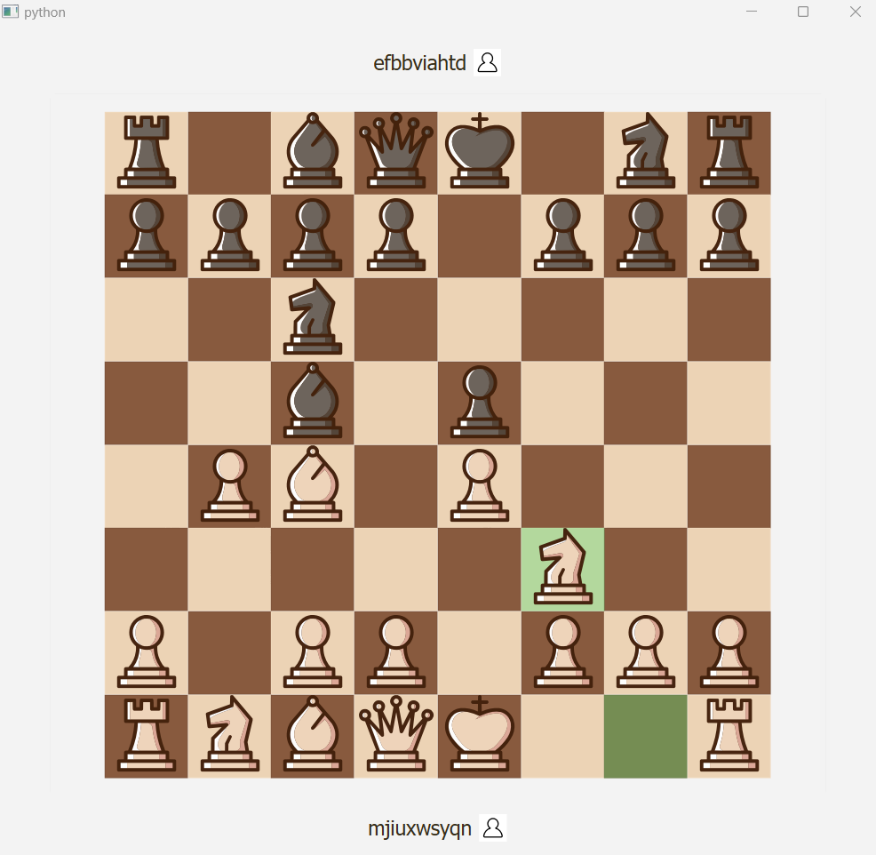

# Chess online

## Description

Implemented in accordance with all the rules of chess.

Playing against a bot, game timer and the return of the move are not implemented yet.

## Installation

Python 3.12.5 is required.

Install requirements with:
```
pip install -r chessOnline/requirements.txt
```

## Usage

Run the game with:
`python chessOnline/main.py`

You can also compile an EXE file using Nuitka:
`python -m nuitka --standalone --onefile --no-pyi-file --remove-output --enable-plugin=pyqt6 chessOnline/main.py`

To create a game lobby, you will need a dedicated ip address, or use Radmin VPN.




